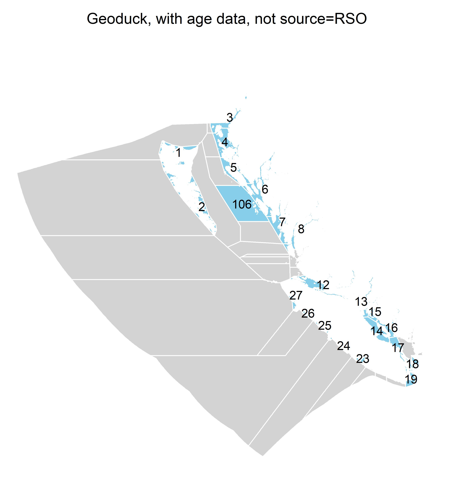

&nbsp;


<style>
  .col2 {
    columns: 2 200px;         /* number of columns and width in pixels*/
    -webkit-columns: 2 200px; /* chrome, safari */
    -moz-columns: 2 200px;    /* firefox */
  }
  .col3 {
    columns: 3 100px;
    -webkit-columns: 3 100px;
    -moz-columns: 3 100px;
  }
  .col4 {
    columns: 4 100px;
    -webkit-columns: 4 100px;
    -moz-columns: 4 100px;
  }
</style>

***


```{r, out.width="1\\linewidth", include=TRUE, fig.align="center", echo=FALSE}
knitr::include_graphics("img/Front Page.jpg")
```

```{r, out.width="0.35\\linewidth", include=TRUE, fig.align="left", echo=FALSE}
knitr::include_graphics("img/logos for tech report.png")
```


***

```{r setup, include=FALSE}
library(dplyr)
library(kableExtra)
library(readxl)

knitr::opts_chunk$set(echo = FALSE)

maketab <- function(dir,Alab="Statistical Area"){
  filenam = list.files(dir)
  nf = length(filenam)
  DF = data.frame(filenam)
  names(DF) = c("Area")
  #filepath = list.files(dir, full.names = T, include.dirs = T)
  fit.link =DF$Area # paste0('<a href=', file.path(dir, filenam), '> ', DF$Area , ' </a>')
  DF$Area <- fit.link
  kable(DF,"latex")|>
  kable_styling(font_size = 10,
                latex_options = c("hold_position"))|>
     row_spec(0,bold=TRUE)
  #DT::datatable(DF, escape=1,
   #             colnames=c(Alab),
    #            filter = 'top',
     #           options = list(
      #            pageLength = 10, 
       #           autoWidth = TRUE,
        #          sDom  = '<"top">lrt<"bottom">ip'))
}


getprojectinfo<-function(page){
  tab=as.data.frame(read_excel("Project_Info/Status Assumptions To do.xlsx", sheet = page))
  tab=tab[,2:3]
  tab[is.na(tab)]=""
  kable(tab,"latex")|>
  kable_styling(font_size = 10)|> 
    column_spec(1, width =   "5cm")|>
    column_spec(2, width =   "10cm")|>
     row_spec(0,bold=TRUE)
}
  

getprog<-function(page){
  tab=as.data.frame(read_excel("Project_Info/Progress.xlsx", sheet = page))
  tab=tab[,2:3]
  tab[is.na(tab)]=""
  kable(tab,"latex")|>
  kable_styling(font_size = 10)|> 
    column_spec(1, width =   "5cm")|>
    column_spec(2, width =   "10cm")|>
    row_spec(0,bold=TRUE)
}
  


```


### Disclaimer

The following work is preliminary and intended only as tool for eliciting feedback on data, modelling and other aspects of these fisheries. 

None of these results are final. 

These analyses do not necessarily reflect the point of view of DFO or other funders and in no way anticipate DFO future policy in this area.

***

### Interactive Report

This Technical Report documents the various components of the Invertebrates Decision Framework. However, due to the complexity of all of the underlying components, it was originally designed as an interactive html document with links to the various supporting reports, figures and documents. The interactive version can be found  [here](https://mis-assess.github.io/csrf_hh_io/3369975a9851e6fd41a0ae6865456662040af596/index.html)

***

### Objective

Establish operating models for at least four species of hand-harvested invertebrates in B.C. for the purposes of informing management decision making including data collection, suitable stock assessment approaches, reference points and harvest control rules.  

***

### Project details

```{r ProjDets, eval=T}
dat<-data.frame(c("Term","Funding body","Funding stream","Solicitation No.","Contract No.","Project Partners","Blue Matter Team","DFO Principal Investigators"),
                
                 c("April 2022 - March 2023, April 2023 - March 2024, May 2024 - March 2025",
                   "Canadian Department of Fisheries and Oceans (DFO)",
                   "ProServices, Medium Complexity Bid",
                   "30003600, 30004307",
                   "4500038008, 4500051010, 4600000482",
                   "Blue Matter Science Ltd.",
                   "Tom Carruthers, Adrian Hordyk, Quang Huynh",
                   "Shannon Obradovich, Mackenzie Mazur"))

kable(dat,"simple",col.names=rep("",2)) 
 

```

***

### Operating models 

An operating model is a theoretical description of fishery and population dynamics used for the testing of management strategies that could include, for example,  data collection protocols, stock assessment methods, harvest control rules, enforcement policies and reference points. In fisheries, operating models are used in closed-loop simulation to test management procedures (aka. harvest strategy) accounting for feedback among the system, data, management procedure and implementation. A management procedure is a rule that calculates management advice from data. Management Strategy Evaluation uses closed-loop simulation of management procedures as a core technical component but is a wider process of stakeholder and manager engagement that identifies system uncertainties, performance metrics, viable management procedures, ultimately aiming to adopt an MP for the provision of management advice for an established time period. 

&nbsp;

#### Reference Case Operating Models

The reference case operating model is used as the single 'base' operating model from which reference set and robustness set operating models are specified. Reference and robustness tests are typically 1-factor departures from the reference case OM, however sometimes reference set OMs are organized in a factorial grid across primary axes of uncertainty. 

&nbsp;

#### Reference Set Operating Models

Reference set operating models span a plausible range of the core uncertainties for states of nature. These are often the types of alternative parameterizations or assumptions that would be included in a stock assessment sensitivity analysis. 

The role of the reference set operating models is to provide the central basis for evaluating the performance of candidate management procedures, for example rejecting badly performing harvest strategies. 

&nbsp;

#### Robustness Set Operating Models

Robustness set operating models are intended to include additional sources of uncertainty for providing further discrimination among management procedures that perform comparably among reference set operating models. 

Robustness operating models often represent system states of nature that are not empirically informed or are hypotheses of a subset of stakeholders.

&nbsp;

***

### Geoduck (*Panopea generosa*)

#### Operating Model Specification

Geoduck operating models were constructed assuming that discrete populations occur at the resolution of statistical area (management area). Models were conditioned using the Rapid Conditioning Model (RCM) of openMSE (SAMtool package, Huynh et al. 2023) and fitted to historical catches, standardized catch-per-unit-effort, sub area age composition data, a current estimate of absolute biomass and biomass trends within statistical area based on bed-level survey data. Given an assumption of asymptotic fleet selectivity and the availability of the absolute biomass estimate, it was possible to estimate natural mortality rate from an informative prior. 

The Reference Case operating model presented here is for statistical area 14 which had numerous age-composition data. 

MSE-style closed-loop projections were undertaken for the current harvest rate (the principal management guideline) and current catch levels. 

&nbsp;

```{r, out.width="0.6\\linewidth", include=TRUE, fig.align="center", fig.cap=c("Statistical Areas for which age data were available and RCM operating models were fitted"), echo=FALSE}

```


&nbsp;

#### Reference Case Operating Model

[Reference Case Operating Model Description (.html)](OM_Descriptions/Ref_Case_Geoduck_Annotated.html)

&nbsp;

#### Comparison of Stat Area Operating Models

Across the 22 Stat. areas for which age-data were available and models could be conditioned to data

[Stat Area Comparisons (.html)](Comparisons/Geoduck_Area_Comparison.html)

&nbsp;

Table 1a. Geoduck RCM model fits 
```{r}
maketab("./OM_Fitting/Geoduck","Statistical Area")
```

&nbsp;

#### Custom Analyses

A summary of the 2024 custom analyses for all species is available [here](Project_Info/Custom Analyses 2023-2024.pdf)

[Some initial closed-loop MSE-type projections were also conducted](MSEs/Geoduck_Demo_MSE.html)

&nbsp;


#### Project Status

&nbsp;

Table 1b. Project Updates and Progress
```{r}
getprog("Geoduck")
```

&nbsp;

Table 1c. Geoduck assumptions and to-do list
```{r}
getprojectinfo("Geoduck")
```

&nbsp;

#### Geoduck Meeting Notes etc

[2023 Meeting Notes (.pdf)](Project_Info/2023_11_17_CSRF_Geoduck_Review.pdf)

&nbsp;

***


### Manila Clam (*Venerupis philippinarum*)


#### Operating Model Specification

Manila clam operating were conditioned to historical catches from 1999 onwards. The model assumes an equilibrium annual catch equal to 75% of the mean catch from 1999-2003. 

The model is fitted to a CMA-level annual time series of survey densities. This was calculated by aggregating density estimates from beaches, where the beach-level data include linear interpolation among years with observed data, and constant extrapolation before and after the first and last observed years, respectively. 

The model was also fitted to fishery length composition data and survey age composition (annulus data). In both cases the selectivities were assumed to be logistic. The fishery selectivity function was parameterized by length, the survey selectivity was parameterized by age. Somatic growth and weight-length parameters were sampled from a multivariate normal distribution arising from variance-covariance matrix of parameter estimates from an MLE fit to annulus data by Statistical Area. 

Since the available data only very weakly inform depletion, the models are configured with an additional prior on current stock depletion for testing robustness of management options to varying levels of stock status.

The operating models were fitted using the [Rapid Conditioning Model (RCM)](https://samtool.openmse.com/reference/RCM.html) included in the openMSE framework. 


```{r, out.width="0.6\\linewidth", include=TRUE, fig.align="center", fig.cap=c("Location of Clam Management Areas."), echo=FALSE}
knitr::include_graphics("OM_Descriptions/Figures/Manila_Clam/Manila_Clam_areas_CMA.jpg")
```

&nbsp;


#### Comparison of Operating Models Across CMAs

Across the 4 Clam Management Areas for which age-data were available and models could be conditioned to data

[Stat Area Comparisons (.html)](Comparisons/Manila_Clam_Area_Comparison.html)

&nbsp;

Table 2a. Manila Clam RCM model fits 
```{r}
maketab("./OM_Fitting/Manila_Clam","Statistical Area")
```

&nbsp;


#### Reference Case Operating Model

[Reference Case Operating Model Description (.html)](OM_Descriptions/Ref_Case_Manila_Clam_Annotated.html)

&nbsp;


#### Custom Analyses

An investigation of minimum size limits and rebuilding was conducted and is documented [here](Project_Info/Custom Analyses 2023-2024.pdf)

[Example closed-loop MSE-type projections were also conducted (.html)](MSEs/Manila_Clam_Demo_MSE.html)

&nbsp;

#### Project Status

\clearpage

Table 2b. Project Updates and Progress
```{r}
getprog("Manila_Clam")
```

&nbsp;

\clearpage

Table 2c. Manila clam assumptions and to-do list

```{r}
getprojectinfo("Manila_Clam")
```

&nbsp;

#### Manilla Clam Meeting Notes etc

[2023 Meeting Notes (.pdf)](Project_Info/2023_11_20_CSRFManilaClam_Review.pdf)


&nbsp;

***


### Green Sea Urchin (*Strongylocentrotus droebachiensis*)


#### Operating Model Specification

Green Urchin operating models were constructed assuming that discrete populations occur at the resolution of Statistical Area (Management Area). Models were conditioned using RCM and fitted to historical catches, historical nominal catch-per-unit-effort, a survey relative abundance index and fleet and survey length composition data. 

The Reference Case operating model presented here is for Statistical Area 12 which has numerous data and corresponds with a reasonably large harvest of urchin. 

MSE-style closed-loop projections were undertaken for the current harvest rate (the principal management guideline) and current catch levels. 

&nbsp;


```{r, out.width="0.6\\linewidth", include=TRUE, fig.align="center", fig.cap=c("Statistical Areas for which composition data and recent catches were available and RCM operating models were fitted."), echo=FALSE}
knitr::include_graphics("OM_Descriptions/Figures/Green_Urchin/GSU_areas.jpg")
```


&nbsp;

#### Comparison of Stat Area Operating Models

[Stat Area Comparisons (.html)](Comparisons/Green_Urchin_Area_Comparison.html)


&nbsp;


Table 3a. Green Urchin RCM model fits 
```{r}
maketab("./OM_Fitting/Green_Urchin","Statistical Area")
```
&nbsp;


#### Reference Case Operating Model

[Reference Case Operating Model Description (.html)](OM_Descriptions/Ref_Case_Green_Urchin_Annotated.html)

&nbsp;


#### Custom Analyses

The results of demonstration analyses is documented [here](Project_Info/Custom Analyses 2023-2024.pdf)

[Also conducted were some example closed-loop MSE-type projections (.html)](MSEs/Green_Urchin_Demo_MSE.html)
 
&nbsp;

#### Project Status

Table 3b. Project Updates and Progress
```{r}
getprog("Green_Urchin")
```

&nbsp;

Table 3c. Green urchin assumptions and to-do list
```{r}
getprojectinfo("Green_Urchin")
```

&nbsp;

#### Green Sea Urchin Meeting Notes etc. 

[Feb 2024 Meeting Notes (.pdf)](Project_Info/Draft summary of Urching CSRF Meeting_Feb13, 2024_ Live Notes.pdf)
 


&nbsp;

***
 
### Giant Red Sea Cucumber (*Apostichopus californicus*)


#### Operating Model Specification

Sea cucumber operating models were configured to be numbers-based due to the inability to age sea cucumbers and representatively measure/weigh them. This entails the following working assumptions: knife-edge growth to size / weight 1 at age 2; Recruitment based on a Beverton-Holt S-R relationship calculated from mature numbers (the model includes a fecundity growth parameter k where fecundity follows a cubic relationship); Asymptotic selectivity from a young age class (e.g. age 4-7).

Since harvesting is by diver and highly selective, regulation is by harvest rate and bag-limit,  the numbers-based operating model is potentially appropriate for the management regime but requires realistic modelling of the bag-limit impacts on discard rate and size selectivity.

Models were conditioned using RCM and fitted to historical catch in numbers, an estimate of absolute numbers, and a time series of survey density estimates.  


&nbsp;


```{r, out.width="0.6\\linewidth", include=TRUE, fig.align="center", fig.cap=c("Location of historical Sea Cucumber harvests."), echo=FALSE}

```


&nbsp;

#### Reference Case Operating Model

[Reference Case Operating Model Description (.html)](OM_Descriptions/Ref_Case_Sea_Cucumber_Annotated.html)

&nbsp;

#### Area comparisons among Subareas (revised for 2024 from QMA) 

[Subarea Comparisons (.html)](Comparisons/Sea_Cucumber_Area_Comparison.html)


&nbsp;

Table 4a. Sea cucumber RCM model fits 
```{r}
maketab("./OM_Fitting/Sea_Cucumber","Subarea")
```


&nbsp;

#### Custom Analyses

In 2023, MSE-style closed-loop projections were undertaken for the current harvest rate, current catch levels and six example management procedures that aim for 2.2, 4.2 and 6.7% harvest rates without alternating closures (C_22, C_42, C_67) and also with alternating closures (Alt_22, Alt_42, Alt_67) whereby the QMA is closed and opened every other projection year. 

The results of these demonstration analyses is documented [here](Project_Info/Custom Analyses 2023-2024.pdf)

&nbsp;


#### Project Status

Table 4b. Project Updates and Progress
```{r}
getprog("Sea_Cucumber")
```

&nbsp;

Table 4c. Green urchin assumptions and to-do list
```{r}
getprojectinfo("Sea_Cucumber")
```

&nbsp;


#### Sea Cucumber Meeting Notes etc

[Feb 2024 Meeting Notes (.pdf)](Project_Info/Draft Summary of Sea Cucumber CSRF Meeting.pdf)


&nbsp;

***

### Software and Code

[csrf_hh_data GitHub Repository](https://github.com/mis-assess/csrf_hh_data)

[openMSE (MSEtool, DLMtool, SAMtool R libraries)](https://openMSE.com)

[Rapid Conditioning Model (RCM) (Huynh 2023)](https://samtool.openmse.com/reference/RCM.html)


***


### Recent Presentations

[Geoduck Nov 2023 (.pdf)](Presentations/Geoduck v2.pdf)

[Manilla Clam Nov 2023 (.pdf)](Presentations/Manilla Clam v4.pdf)

[Cucumber Feb 2024 (.pdf)](Presentations/Cucumber 3.pdf)

[Urchin Feb 2024 (.pdf)](Presentations/Urchin 4.pdf)

***

### References

[DFO 2021 (Anderson et al)](References/MPframework.pdf)

[Geoduck IFMP](References/Geoduck_IFMP.pdf)

[Green Sea Urchin IFMP](References/GSU_IFMP.pdf)

[Sea Cucumber IFMP](References/Sea_Cucumber_IFMP.pdf)

[Intertidal Clam IFMP](References/Intertidal_Clams_IFMP.pdf)

***

### Acknowledgements

Many thanks to Shannon Obradovich and Mackenzie Mazur for helping to direct and manage the research project. 

Special thanks to Rob Flemming for his help in providing and explaining the various datasets and also to Dominique Bureau for providing guidance on data interpretation and reviewing materials. 

Thanks to Ken Fong for his overview and expertise on the historical aspects of the fisheries, science and management programmes. 

Many thanks also to the contribution of individuals on the species-specific analyses: 

(Technical support)  Meghan Burton; Mackenzie Mazur; Kelsey Dougan; 

(Managers) Amy Ganton, Brittany Myhal, Pauline Ridings, Jenny Smith, Erin Wylie;

(Geoduck collaborators)  Erin Porszt, Dominique Bureau;

(Manila clam collaborators) Alexander Dalton, Dominique Bureau, Coral Cargill;

(Green urchin collaborators) Lyanne Curtis, Christine Hansen, Travis Bell; 

(Sea cucumber collaborators) Jill Campbell, Christine Hansen, Erin Wylie, Travis Bell;


***

&nbsp;&nbsp;&nbsp;&nbsp;&nbsp;&nbsp;&nbsp;&nbsp;&nbsp;&nbsp;&nbsp;&nbsp;


