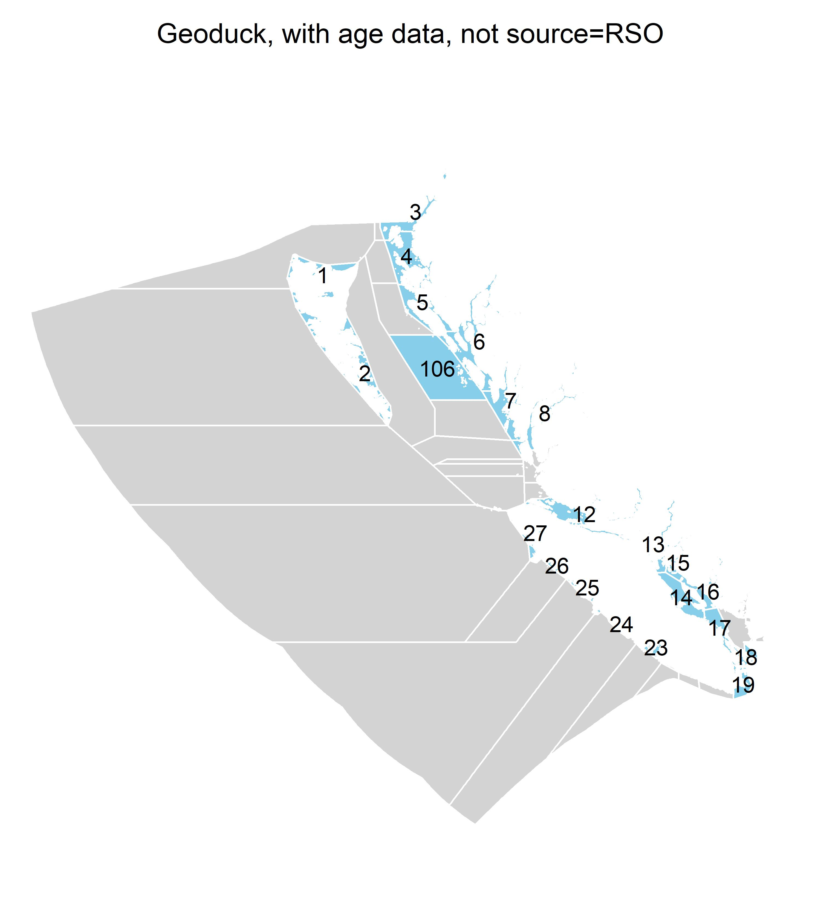
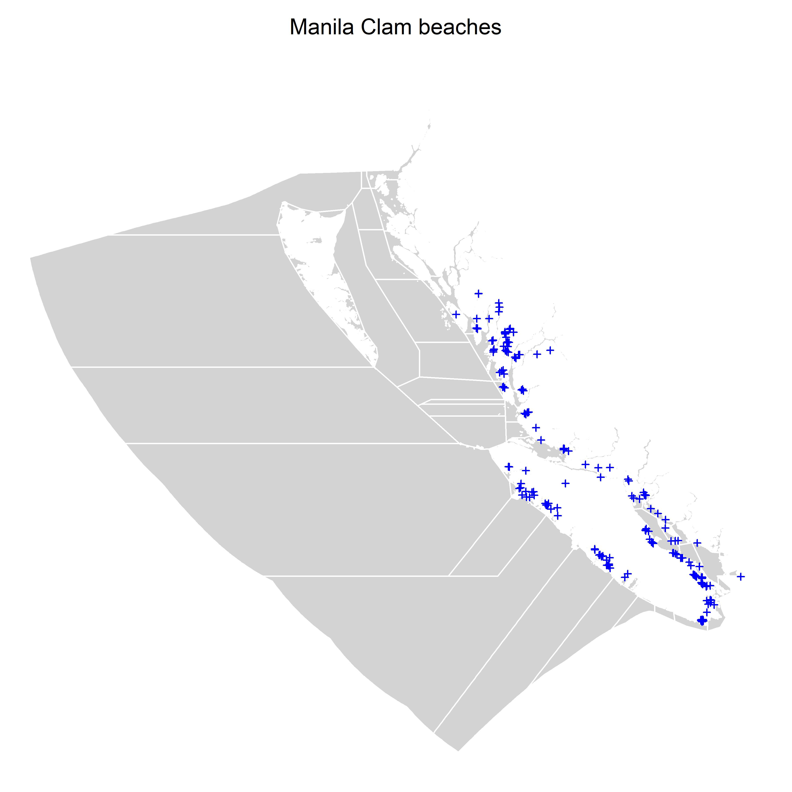
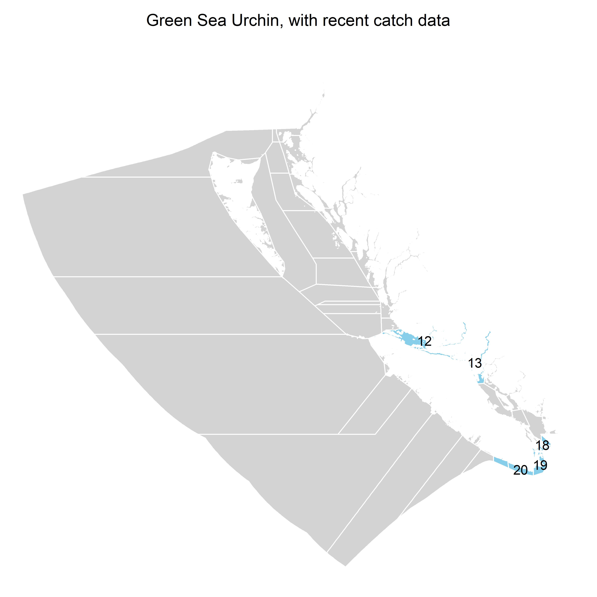
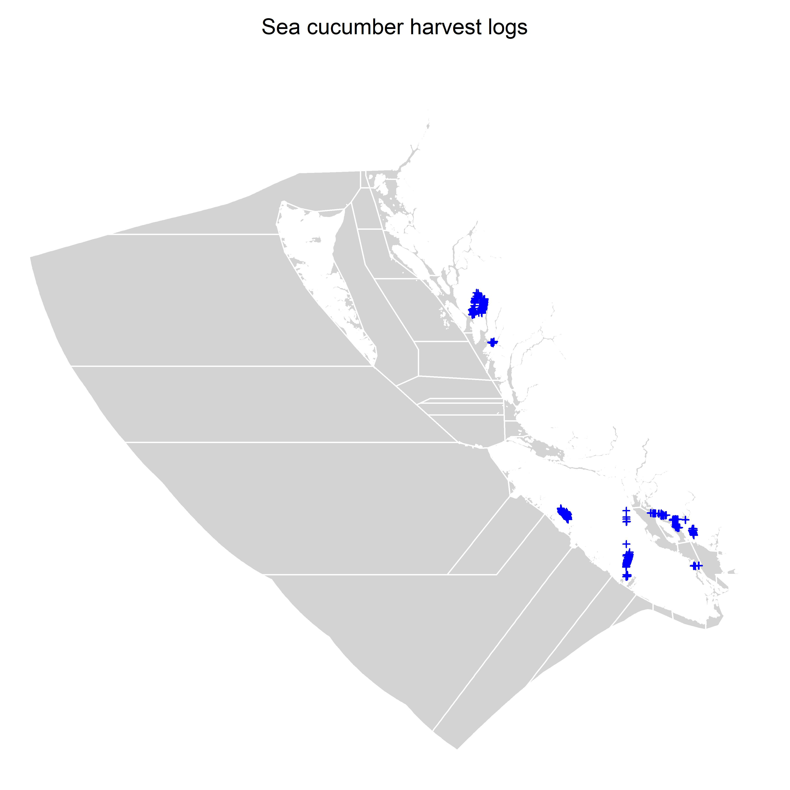

&nbsp;


<style>
  .col2 {
    columns: 2 200px;         /* number of columns and width in pixels*/
    -webkit-columns: 2 200px; /* chrome, safari */
    -moz-columns: 2 200px;    /* firefox */
  }
  .col3 {
    columns: 3 100px;
    -webkit-columns: 3 100px;
    -moz-columns: 3 100px;
  }
  .col4 {
    columns: 4 100px;
    -webkit-columns: 4 100px;
    -moz-columns: 4 100px;
  }
</style>  
  
<style type="text/css">

pre code {
  word-wrap: normal;
  white-space: pre;
}
body{ /* Normal  */
   font-size: 12px;
}
td {  /* Table  */
   font-size: 9px;
}
h1 { /* Header 1 */
 font-size: 18px;
 color: DarkBlue;
}
h2 { /* Header 2 */
 font-size: 15px;
 color: DarkBlue;
}
h3 { /* Header 3 */
 font-size: 14px;
 color: DarkBlue;
}
code.r{ /* Code block */
  font-size: 10px;
}
pre { /* Code block */
  font-size: 10px;
  overflow-x: auto;
}
</style>


***


***

&nbsp;


***

```{r setup, include=FALSE}
library(dplyr)
library(kableExtra)
library(readxl)

knitr::opts_chunk$set(echo = FALSE)

maketab <- function(dir,Alab="Statistical Area"){
  filenam = list.files(dir)
  nf = length(filenam)
  DF = data.frame(filenam)
  names(DF) = c("Area")
  #filepath = list.files(dir, full.names = T, include.dirs = T)
  fit.link = paste0('<a href=', file.path(dir, filenam), '> ', DF$Area , ' </a>')
  DF$Area <- fit.link
  DT::datatable(DF, escape=1,
                colnames=c(Alab),
                filter = 'top',
                options = list(
                  pageLength = 10, 
                  autoWidth = TRUE,
                  sDom  = '<"top">lrt<"bottom">ip'))
}


getprojectinfo<-function(page){
  tab=as.data.frame(read_excel("Project_Info/Status Assumptions To do.xlsx", sheet = page))
  tab=tab[,2:3]
  tab[is.na(tab)]=""
  kable(tab,"simple")#,col.names=rep("",2)) 
}
  

getprog<-function(page){
  tab=as.data.frame(read_excel("Project_Info/Progress.xlsx", sheet = page))
  tab=tab[,2:3]
  tab[is.na(tab)]=""
  kable(tab,"simple")#,col.names=rep("",2)) 
}
  


```


# Disclaimer

The following work describes a flexible framework for characterising population and fishery dynamics and evaluating management strategies. It does not represent final results or products. The framework has not been subject to formal peer-review.  

This work does not necessarily reflect the point of view of DFO or other funders and in no way does it anticipate DFO future policy.


<br>

***

# Project details

```{r ProjDets, eval=T}
dat<-data.frame(c("Term","Funding body","Funding stream","Solicitation No.","Contract No.","Project Partners","Blue Matter Team","DFO Principal Investigators"),
                
                 c("April 2022 - March 2023, April 2023 - March 2024, April 2024 - March 2025",
                   "Canadian Department of Fisheries and Oceans (DFO)",
                   "ProServices, Medium Complexity Bid",
                   "30003600, 30004307",
                   "4500038008, 4500051010, 4600000482",
                   "Blue Matter Science Ltd.",
                   "Tom Carruthers, Adrian Hordyk, Quang Huynh",
                   "Shannon Obradovich, Mackenzie Mazur"))

kable(dat,"simple",col.names=rep("",2)) 
 

```

<br>

***

# Objective

Establish operating models for at least four species of hand-harvested invertebrates in B.C. for the purposes of informing management decision making including data collection, suitable stock assessment approaches, reference points and harvest control rules. 

<br>

***

# Introduction

As part of the approach to meeting the Fish Stocks provisions (FSP) in the revised Fisheries Act, DFO’s Marine Invertebrate Section (MIS) has been adapting the Management Procedure (MP) Framework (Anderson et al. 2021), a decision support tool, to support investigation of management decisions related to conservation objectives for Pacific marine invertebrates. This project will result in a decision support tool  for exploring impacts of spatial closures (Marine Spatial Planning) and other management actions, in order to better understand trade-offs for decision makers under future marine ecosystem and human use (primarily fishing) scenarios.  

Fisheries for hand-harvested invertebrates (HHI) present opportunities and challenges for science and management that are often not pertinent to fisheries for pelagic finfish. Populations at the scale of the B.C. coastline are likely to have regional sub-population dynamics at varying spatial scales with uncertain larval dispersal and exchange of biomass. Data on HHI may come from a mix of commerical, recreational and organized scientific surveys that are often not available for earlier time periods of substantial exploitation. While aspects of population dynamics and structure may be highly uncertain, the prescriptive nature of management measures (e.g. minimum size limits, rotational spatial closures, gear restrictions) for HHI could be highly robust and support the sustainable exploitation of productive stocks. This research and decision support tools use operating models and Management Strategy Evaluation (MSE) simulation testing to characterize scientific uncertainty to inform robust management decision making.

These libraries adapt existing tools of the MP Framework to: define reference case and robustness operating models (OMs); define quantitative performance metrics; test alternative management procedures, calculate appropriate reference points, with management options relevant for marine invertebrates; and determining additional management objectives beyond the FSP for the four case studies (Geoduck, intertidal clams, Green Sea Urchin, and Giant Red Sea Cucumber).

&nbsp;

***

# Generic Methodologies

## Operating model conditioning

The operating models were fitted using the [Rapid Conditioning Model (RCM)](https://samtool.openmse.com/reference/RCM.html) included in the openMSE framework. This isH a statistical-catch-at-age (or length) age structured population and fishery dynamics model comparable to Stock Synthesis. Similarly to assessment frameworks like WHAM, RCM is implemented natively in R using Template Model Builder as the non-linear estimation framework. 

An RCM fit was conducted for multiple draws (simulations) of biological inputs, thereby spanning a wide range of uncertainty appropriate for B.C. inverts (e.g. steepness for all species, maturity and growth for Sea Cucumbers). Each RCM model fit provides estimates of unfished recruitment (scale), annual recruitment deviations, fishery selectivity parameters and apical F (fishing mortality rate on the most selected age class). Operating models exacty match the historical reconstruction according to RCM and then project the fishing and population dynamics for the purposes of evaluating alternative management options. 

## Uncertainty in Biological Parameters

In all case studies except Sea Cucumbers, somatic growth and weight-length relationships were characterized by fitting models to data. Uncertainty was propagated by drawing samples from the fitted relationships subject to estimation error.

Uncertainty in steepness (resilience) and maturity were incorporated by sampling from uniform ranges (e.g., steepness in the range of 0.6-0.9, length at 50% maturity in the range of 25-28mm, etc).

&nbsp;

***


# Geoduck (*Panopea generosa*)

## Operating Model Specification

Geoduck operating models were constructed assuming that discrete populations occur at the resolution of statistical area (management area). Models  fitted to historical catches from 1976 - 2023, standardized catch-per-unit-effort, sub area age composition data, a current estimate of absolute biomass and biomass trends within statistical area based on bed-level survey data. Given an assumption of asymptotic fleet selectivity and the availability of the absolute biomass estimate, it was possible to estimate natural mortality rate from an noninformative prior. 

&nbsp;



Figure 1. Statistical Areas for which age data were available and RCM operating models were fitted. 

&nbsp;


## Geoduck Meeting Notes etc

[2023 Meeting Notes (.pdf)](Project_Info/2023_11_17_CSRF_Geoduck_Review.pdf)

&nbsp;

***

# Manila Clam (*Venerupis philippinarum*)


## Operating Model Specification

Manila clam operating were conditioned to historical catches from 2000 to 2021. The model assumes an equilibrium annual catch equal to 75% of the mean catch from 1999-2003. The model is fitted to a CMA-level annual time series of survey densities. The model was also fitted to fishery length composition data and survey length- and age-composition (annulus data). In both cases the selectivities were assumed to be logistic. The fishery selectivity function was parameterized by length, the survey selectivity was parameterized by age. Since the available data only very weakly inform depletion, the models are configured with an additional prior on current stock depletion for testing robustness of management options to varying levels of stock status.

&nbsp;



Figure 2. Location of Clam Management Areas. 

&nbsp;


## Manilla Clam Meeting Notes etc

[2023 Meeting Notes (.pdf)](Project_Info/2023_11_20_CSRFManilaClam_Review.pdf)

&nbsp;

***

# Green Sea Urchin (*Strongylocentrotus droebachiensis*)

## Operating Model Specification

Green Urchin operating models were constructed assuming that discrete populations occur at the resolution of Statistical Area (Management Area). Models were conditioned on historical catches from 1987-2020, historical nominal catch-per-unit-effort, a survey relative abundance index, fleet and survey length composition data and survey age composition data. 

&nbsp;



Figure 3. Statistical Areas for which composition data and recent catches were available and RCM operating models were fitted. 

&nbsp;


&nbsp;

## Green Sea Urchin Meeting Notes etc. 

[Feb 2024 Meeting Notes (.pdf)](Project_Info/Draft summary of Urching CSRF Meeting_Feb13, 2024_ Live Notes.pdf)
 

&nbsp;

***
 
# Giant Red Sea Cucumber (*Apostichopus californicus*)


## Operating Model Specification

Sea cucumber operating models were configured to be numbers-based due to the inability to age sea cucumbers and representatively measure/weigh them. This entails the following working assumptions: knife-edge growth to size / weight 1 at age 2; Recruitment based on a Beverton-Holt S-R relationship calculated from mature numbers (the model includes a fecundity growth parameter k where fecundity follows a cubic relationship); Asymptotic selectivity from a young age class (e.g. age 4-7).

Since harvesting is by diver and highly selective, regulation is by harvest rate and bag-limit,  the numbers-based operating model is potentially appropriate for the management regime but requires realistic modelling of the bag-limit impacts on discard rate and size selectivity.

Models were conditioned on historical catch in numbers from 1970-2021, an estimate of absolute numbers, and a time series of survey density estimates.  

&nbsp;



Figure 4. Location of historical Sea Cucumber harvests. 

&nbsp;


## Sea Cucumber Meeting Notes etc

[Feb 2024 Meeting Notes (.pdf)](Project_Info/Draft Summary of Sea Cucumber CSRF Meeting.pdf)


&nbsp;

***

# The B.C. Hand Harvested Invertebrate MSE Framework Libraries

All data, parameters, conditioning approaches and management procedures are available in a set of fully documented R packages. 

The manual for installing and using these packages is available [online](https://blue-matter.github.io/Inverts/) 

The framework consists of five R packages that can be installed from the R command prompt (see User Manual above for installation instructions). These consist of a package Inverts that contains any functions generic to all invertebrate analyses, it also includes this manual and example objects that can be used for demonstration purposes. 

[Inverts - an R package of generic MSE functions](https://github.com/blue-matter/Inverts)

There are also four species-specific packages that contain inputs, data, conditioning approaches and management procedures specific to each of the case study species:

[Inverts.GD - data, operating models and MPs for Geoduck](https://github.com/blue-matter/Inverts_GD)

[Inverts.GSU - data, operating models and MPs for Green Sea Urchin](https://github.com/blue-matter/Inverts_GSU)

[Inverts.MC - data, operating models and MPs for Manila Clam](https://github.com/blue-matter/Inverts_MC)

[Inverts.RSC - data, operating models and MPs for Red Sea Cucumber](https://github.com/blue-matter/Inverts_RSC)

These libraries contain fully documented functions for conducting all aspects of data manipulation, operating model conditioning and the investigation and performance evaluation of status-quo and alternative management strategies. 

&nbsp;

***

# Other Software and Code

[csrf_hh_data GitHub Repository](https://github.com/mis-assess/csrf_hh_data)

[openMSE (MSEtool, DLMtool, SAMtool R libraries)](https://openMSE.com)

[Rapid Conditioning Model (RCM) (Huynh 2025)](https://samtool.openmse.com/reference/RCM.html)


&nbsp;

***


# Recent Presentations

[Geoduck Nov 2023 (.pdf)](Presentations/Geoduck v2.pdf)

[Manilla Clam Nov 2023 (.pdf)](Presentations/Manilla Clam v4.pdf)

[Cucumber Feb 2024 (.pdf)](Presentations/Cucumber 3.pdf)

[Urchin Feb 2024 (.pdf)](Presentations/Urchin 4.pdf)

&nbsp;

***

# References

[DFO 2021 (Anderson et al)](References/MPframework.pdf)

[Geoduck IFMP](References/Geoduck_IFMP.pdf)

[Green Sea Urchin IFMP](References/GSU_IFMP.pdf)

[Sea Cucumber IFMP](References/Sea_Cucumber_IFMP.pdf)

[Intertidal Clam IFMP](References/Intertidal_Clams_IFMP.pdf)

&nbsp;

***

# Acknowledgements

Many thanks to Shannon Obradovich and Mackenzie Mazur for helping to direct and manage the research project. 

Special thanks to Rob Flemming for his help in providing and explaining the various datasets and also to Dominique Bureau for providing guidance on data interpretation and reviewing materials. 

Thanks to Ken Fong for his overview and expertise on the historical aspects of the fisheries, science and management programmes. 

Many thanks also to the contribution of individuals on the species-specific analyses: 

(Technical support)  Meghan Burton; Mackenzie Mazur; Kelsey Dougan; 

(Managers) Amy Ganton, Brittany Myhal, Pauline Ridings, Jenny Smith, Erin Wylie;

(Geoduck collaborators)  Erin Porszt, Dominique Bureau;

(Manila clam collaborators) Alexander Dalton, Dominique Bureau, Coral Cargill;

(Green urchin collaborators) Lyanne Curtis, Christine Hansen, Travis Bell; 

(Sea cucumber collaborators) Jill Campbell, Christine Hansen, Erin Wylie, Travis Bell;

&nbsp;

***

# Appendix: Operating Models

An operating model is a theoretical description of fishery and population dynamics used for the testing of management strategies that could include, for example,  data collection protocols, stock assessment methods, harvest control rules, enforcement policies and reference points. In fisheries, operating models are used in closed-loop simulation to test management procedures (aka. harvest strategy) accounting for feedback among the system, data, management procedure and implementation. A management procedure is a rule that calculates management advice from data. Management Strategy Evaluation uses closed-loop simulation of management procedures as a core technical component but is a wider process of stakeholder and manager engagement that identifies system uncertainties, performance metrics, viable management procedures, ultimately aiming to adopt an MP for the provision of management advice for an established time period. 

&nbsp;

## Reference Case Operating Models

The reference case operating model is used as the single 'base' operating model from which reference set and robustness set operating models are specified. Reference and robustness tests are typically 1-factor departures from the reference case OM, however sometimes reference set OMs are organized in a factorial grid across primary axes of uncertainty. 

&nbsp;

## Reference Set Operating Models

Reference set operating models span a plausible range of the core uncertainties for states of nature. These are often the types of alternative parameterizations or assumptions that would be included in a stock assessment sensitivity analysis. 

The role of the reference set operating models is to provide the central basis for evaluating the performance of candidate management procedures, for example rejecting badly performing harvest strategies. 

&nbsp;

## Robustness Set Operating Models

Robustness set operating models are intended to include additional sources of uncertainty for providing further discrimination among management procedures that perform comparably among reference set operating models. 

Robustness operating models often represent system states of nature that are not empirically informed or are hypotheses of a subset of stakeholders.

&nbsp;
***

&nbsp;&nbsp;&nbsp;&nbsp;&nbsp;&nbsp;&nbsp;&nbsp;&nbsp;&nbsp;&nbsp;&nbsp;

