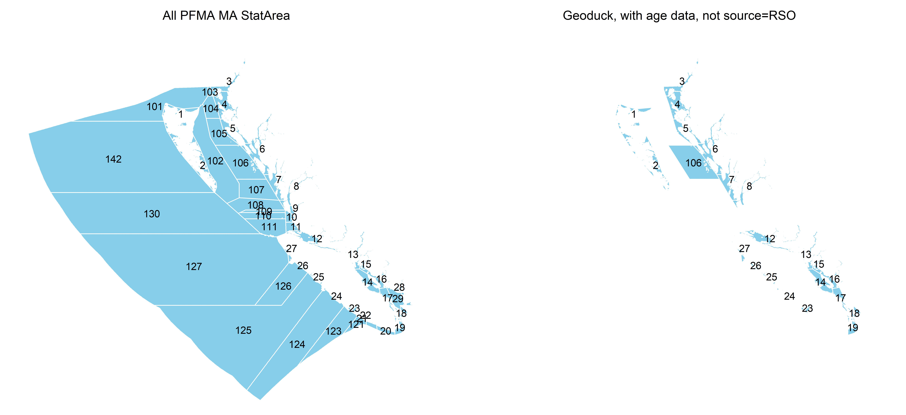
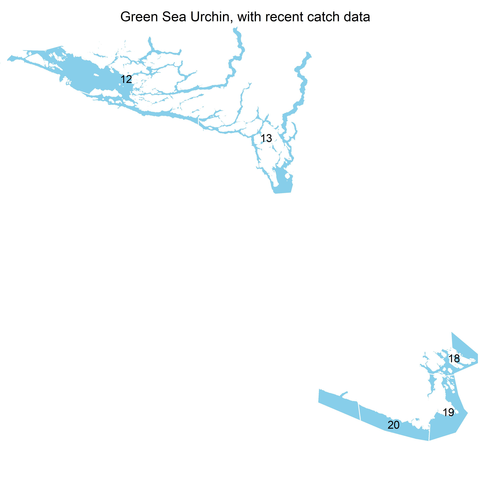
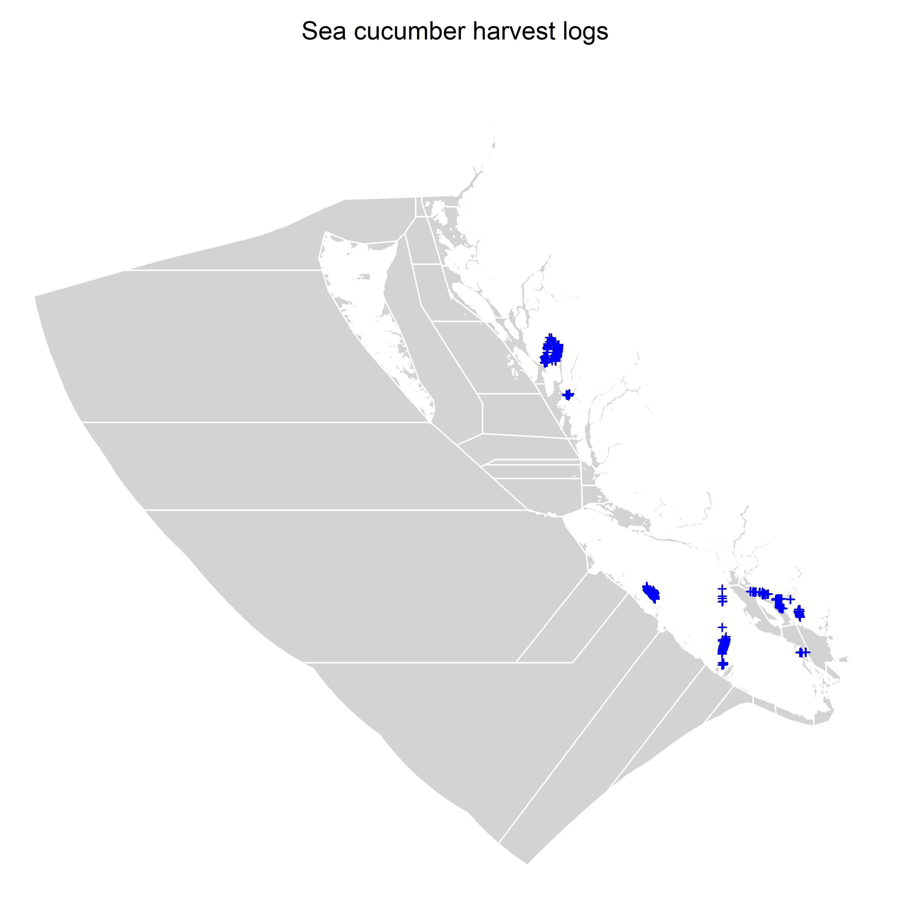
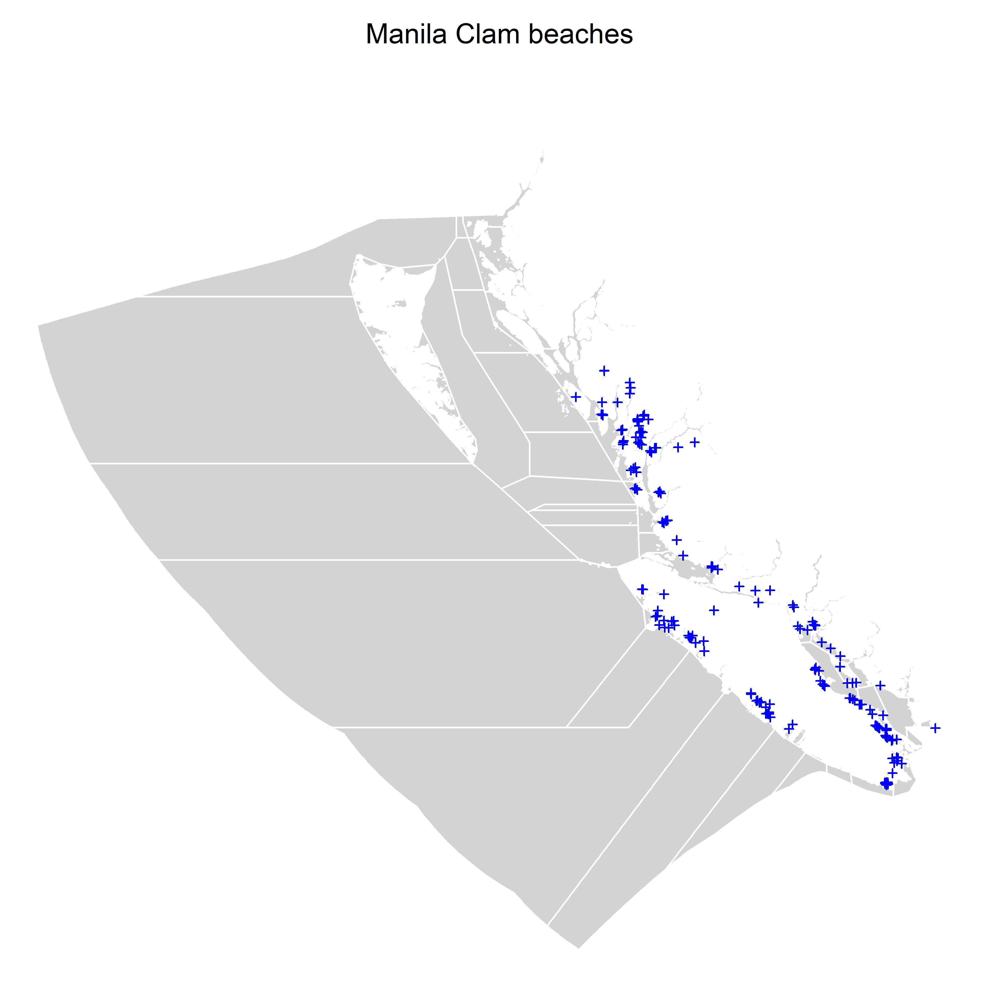

&nbsp;


<style>
  .col2 {
    columns: 2 200px;         /* number of columns and width in pixels*/
    -webkit-columns: 2 200px; /* chrome, safari */
    -moz-columns: 2 200px;    /* firefox */
  }
  .col3 {
    columns: 3 100px;
    -webkit-columns: 3 100px;
    -moz-columns: 3 100px;
  }
  .col4 {
    columns: 4 100px;
    -webkit-columns: 4 100px;
    -moz-columns: 4 100px;
  }
</style>

***


***

&nbsp;


***

```{r setup, include=FALSE}
library(dplyr)
library(kableExtra)
library(readxl)

knitr::opts_chunk$set(echo = FALSE)

maketab <- function(dir,Alab="Statistical Area"){
  filenam = list.files(dir)
  nf = length(filenam)
  DF = data.frame(filenam)
  names(DF) = c("Area")
  #filepath = list.files(dir, full.names = T, include.dirs = T)
  fit.link = paste0('<a href=', file.path(dir, filenam), '> ', DF$Area , ' </a>')
  DF$Area <- fit.link
  DT::datatable(DF, escape=1,
                colnames=c(Alab),
                filter = 'top',
                options = list(
                  pageLength = 10, 
                  autoWidth = TRUE,
                  sDom  = '<"top">lrt<"bottom">ip'))
}


getprojectinfo<-function(page){
  
  tab=as.data.frame(read_excel("Project_Info/Status Assumptions To do.xlsx", sheet = page))
  tab=tab[,2:3]
  tab[is.na(tab)]=""
  kable(tab,"simple")#,col.names=rep("",2)) 
}
  


```


### Disclaimer

The following work is preliminary and intended only as tool for eliciting feedback on data, modelling and other aspects of these fisheries. 

None of these results are final. 

These analyses do not necessarily reflect the point of view of DFO or other funders and in no way anticipate DFO future policy in this area.

***

### Objective

Establish operating models for at least four species of hand-harvested invertebrates in B.C. for the purposes of informing management decision making including data collection, suitable stock assessment approaches, reference points and harvest control rules.  

***

### Project details

```{r ProjDets, eval=T}
dat<-data.frame(c("Term","Funding body","Funding stream","Solicitation No.","Contract No.","Project Partners","Blue Matter Team","DFO Principal Investigators"),
                
                 c("April 2022 - March 2023",
                   "Canadian Department of Fisheries and Oceans (DFO)",
                   "ProServices, Medium Complexity Bid",
                   "30003600",
                   "4500038008",
                   "Blue Matter Science Ltd.",
                   "Tom Carruthers, Adrian Hordyk, Quang Huynh",
                   "Shannon Obradovich, Mackenzie Mazur"))

kable(dat,"simple",col.names=rep("",2)) 
 

```


***


### Geoduck (*Panopea generosa*)

Geoduck operating models were constructed assuming that discrete populations occur at the resolution of Statistical Area (Management Area). Models were conditioned using the Rapid Conditioning Model (RCM) of openMSE (SAMtool package, Huynh et al. 2023) and fitted to historical catches, (vague, nominal) historical catch-per-unit-effort, age composition data, and a current estimate of absolute biomass. Given an assumption of asymptotic fleet selectivity and the availability of the absolute biomass estimate, it was possible to estimate natural mortality rate from a non-informative prior. 

The Reference Case operating model presented here is for Statistical Area 14 which had numerous age-composition data. 

MSE-style closed-loop projections were undertaken for the current harvest rate (the principal management guideline) and current catch levels. 

&nbsp;



Figure 1. Statistical Areas for which age data were available and RCM operating models were fitted. 

&nbsp;


[Reference Case Operating Model Description (.html)](OM_Descriptions/Ref_Case_Geoduck_Annotated.html)

[Stat Area Comparisons (.html)](Comparisons/Geoduck_Area_Comparison.html)

[Closed-loop MSE-type projections (.html)](MSEs/Geoduck_Demo_MSE.html)

&nbsp;

Table 1a. Geoduck RCM model fits 
```{r}
maketab("./OM_Fitting/Geoduck","Statistical Area")
```

&nbsp;

Table 1b. Geoduck assumptions and to-do list
```{r}
getprojectinfo("Geoduck")
```

***

### Green Sea Urchin (*Strongylocentrotus droebachiensis*)

Green Urchin operating models were constructed assuming that discrete populations occur at the resolution of Statistical Area (Management Area). Models were conditioned using RCM and fitted to historical catches, historical nominal catch-per-unit-effort, a survey relative abundance index and fleet and survey length composition data. 

The Reference Case operating model presented here is for Statistical Area 12 which has numerous data and corresponds with a reasonably large harvest of urchin. 

MSE-style closed-loop projections were undertaken for the current harvest rate (the principal management guideline) and current catch levels. 

&nbsp;



Figure 2. Statistical Areas for which composition data and recent catches were available and RCM operating models were fitted. 

&nbsp;

[Reference Case Operating Model Description (.html)](OM_Descriptions/Ref_Case_Green_Urchin_Annotated.html)

[Stat Area Comparisons (.html)](Comparisons/Green_Urchin_Area_Comparison.html)

[Closed-loop MSE-type projections (.html)](MSEs/Green_Urchin_Demo_MSE.html)

&nbsp;

Table 2a. Green Urchin RCM model fits 
```{r}
maketab("./OM_Fitting/Green_Urchin","Statistical Area")
```

&nbsp;

Table 2b. Green urchin assumptions and to-do list
```{r}
getprojectinfo("Green_Urchin")
```

***


### Giant Red Sea Cucumber (*Apostichopus californicus*)

Sea cucumber operating models were configured to be numbers-based:due to the inability to age sea cucumbers and representatively measure/weight them. This entails the following working assumptioins: knife-edge growth to size / weight 1 at age 2; Recruitment based on a Beverton-Holt calculated from to mature numbers (although this can be modified later); Asymptotic selectivity from young age class (e.g. age 4-7).

Since harvesting is by diver and highly selective, regulation is by harvest rate and bag-limit and the numbers-based operating model is potentially appropriate for the management regime but requires realistic modelling of the bag limit impacts on discard rate and size selectivity.

Models were conditioned using RCM and fitted to historical catches, an estimate of absolute biomass, a time series of survey density estimates.  

The Reference Case operating model presented here is for Quota Management Area 25A (Nootka / Tahsis on the WCVI, Subareas 25-6, 25-8, 25-9, 25-12, 25-15) which was seleected for its relatively long history of density surveys and recent reopening in 2020.

MSE-style closed-loop projections were undertaken for the current harvest rate, current catch levels and six example management procedures that aim for 2.2, 4.2 and 6.7% harvest rates without alternating closures (C_22, C_42, C_67) and also with alternating closures (Alt_22, Alt_42, Alt_67) whereby the QMA is closed and opened every other projection year. 


&nbsp;



Figure 1. Location of historical Sea Cucumber harvests. 

&nbsp;


[Reference Case Operating Model Description (.html)](OM_Descriptions/Ref_Case_Sea_Cucumber_Annotated.html)

[QMA Comparisons (.html)](Comparisons/Sea_Cucumber_Area_Comparison.html)

[Closed-loop MSE-type projections (.html)](MSEs/Sea_Cucumber_Demo_MSE.html)

&nbsp;

Table 3a. Sea cucumber RCM model fits 
```{r}
maketab("./OM_Fitting/Sea_Cucumber","Quota Management Area")
```

&nbsp;

Table 3b. Sea cucumber assumptions and to-do list
```{r}
getprojectinfo("Sea_Cucumber")
```

***

### Manila Clam (*Venerupis philippinarum*)

Given the current unavailability of harvest data (I did not have time to pursue it!) a scale-free operating model was conditioned on recent fleet composition data using RCM, assuming stable recent fishing effort (exploitation rate) and asymptotic (flat-topped) selectivity (i.e. comparable to a non-equilibrium length based assessment approach such as non-eq LBSPR (Hordyk et al.).

The Reference Case operating model presented here is for beach 17-19-002 which has relatively numerous length samples.  

MSE-style closed-loop projections were undertaken for the current harvest rate and current catch levels. 


&nbsp;



Figure 1. Location of beaches where manila clams are surveyed. 

&nbsp;


[Reference Case Operating Model Description (.html)](OM_Descriptions/Ref_Case_Manila_Clam_Annotated.html)

[Beach Comparisons (.html)](Comparisons/Manila_Clam_Area_Comparison.html)

[Closed-loop MSE-type projections (.html)](MSEs/Manila_Clam_Demo_MSE.html)


&nbsp;

Table 4a. Manila clam RCM model fits 
```{r}
maketab("./OM_Fitting/Manila_Clam","Beach")
```

&nbsp;

Table 4b. Manila clam assumptions and to-do list
```{r}
getprojectinfo("Manila_Clam")
```


***

### Software and Code

[csrf_hh_data GitHub Repository](https://github.com/mis-assess/csrf_hh_data)

[openMSE (MSEtool, DLMtool, SAMtool R libraries)](https://openMSE.com)

[Rapid Conditioning Model (RCM) (Huynh 2023)](https://samtool.openmse.com/reference/RCM.html)


***

### References

[DFO 2021 (Anderson et al)](References/MPframework.pdf)

[Geoduck IFMP](References/Geoduck_IFMP.pdf)

[Green Sea Urchin IFMP](References/GSU_IFMP.pdf)

[Sea Cucumber IFMP](References/Sea_Cucumber_IFMP.pdf)

[Intertidal Clam IFMP](References/Intertidal_Clams_IFMP.pdf)

***

### Acknowledgements

Special thanks to Rob Flemming for his help in providing and explaining the various datasets and also to Dominique Bureau for providing guidance on data interpretation and reviewing materials. 

Geoduck collaborators: Erin Porszt, Dominique Bureau

Green urchin collaborators: Lyanne Curtis, Christine Hansen

Sea cucumber collaborators: Jill Campbell, Christine Hansen

Manila clam collaborators: Alexander Dalton, Dominique Bureau

***

&nbsp;&nbsp;&nbsp;&nbsp;&nbsp;&nbsp;&nbsp;&nbsp;&nbsp;&nbsp;&nbsp;&nbsp;

